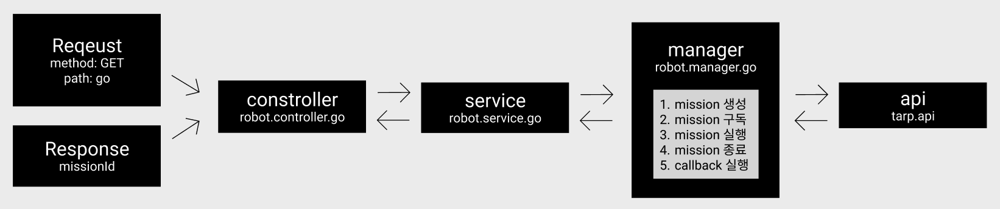

# 🍴 환경 설정

1. Node.js [설치](https://nodejs.org/en) (>=18.0.0)
```shell
node --version
```

2. Yarn 설치

```shell
npm install --global yarn
```

3. Yarn 버전 확인

```shell
yarn --version
```

<br><br>

# 🚀 설치

1. 레포지토리 클론

```shell
git clone https://github.com/sanghoTW/bff-test.git
```

2. 패키지 설치

```shell
yarn install
```

3. 환경 변수 설정

- 프로젝트 내부 `.env` 파일에 환경 변수(TARP 개발 서버 주소 및 토큰) 설정
- 토큰은 `TARP Client`에 직접 로그인 후 발급받아 설정

```
WS_TARP_SERVER = 'wss://dev-tarp-server/query'
TARP_SERVER = 'https://dev-tarp-server/query'
TARP_TOKEN = 'tarp-access-token'
```

<br><br>

# 🚨 프로젝트 구조
- 미션: TARP에 미션을 생성해서 로봇 제어하기

<br>



<br>

1. `robot.controller.go`는 `request`를 받고 `robot.service.go`를 호출한다.
2. `robot.service.go`는 `robot.manager.go`를 호출한다.
3. `robot.manager.go`는 `robot.api`를 호출하여 미션을 조작한다.
4. `mission` 생성과 구독을 진행하고, 변경되는 `mission`상태에 따라서 `mission`을 실행 및 종료한다.
5. `mission`이 종료되는 시점에 등록했던 `callback` 호출 및 구독 연결을 끊는다.
6. `response`로 `missionId`를 반환한다.

<br><br>

# 🎸 테스트 방법 (`GS_2` 워크스페이스 기준으로 설명)

1. 목 로봇에 할당되어 있는 미션 종료
- 테스트에 사용될 목 로봇에 미션이 할당되어 있다면 종료시켜야 합니다.
- 종료 방법은 아래와 같습니다.

```
1. dev tarp client -> GS_2 워크스페이스 접속
2. 로봇 클릭
3. 수행중인 미션이 있다면 종료
```
<br>

2. 서버 시작 

```shell
yarn start:dev
```

<br>

3. 데이터 셋팅
- `robot.service.ts`파일 내부의 `go`함수에 데이터 셋팅
  - roadMapId
  - robotKey
  - destinationId
  - callback
- `GS_2` 워크스페이스 기준으로 데이터가 미리 셋팅되어 있습니다.

<br>

4. API 호출 
- 브라우저 주소창에 `localhost:3000/go` 입력하여 `API` 호출
- `API`가 정상적으로 완료되면 브라우저에 미션 아이디가 출력됩니다.
- 터미널에서 구독된 미션의 상태 확인이 가능합니다.
